# Rikka Note

一个使用 Vue 3 + Tauri 2.x 开发的跨平台笔记应用，目前只支持桌面端。

**注：大量使用AI开发**

## 核心特色

面向普通个人用户、隐私、智能、本地化

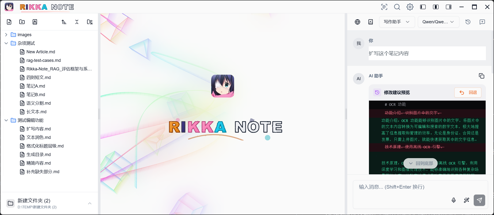

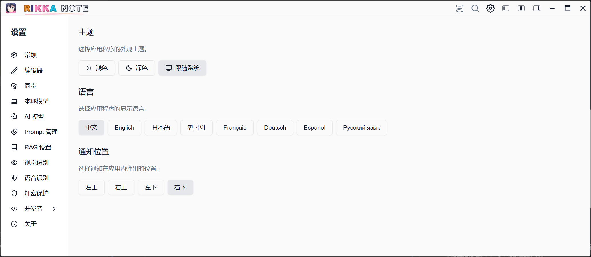

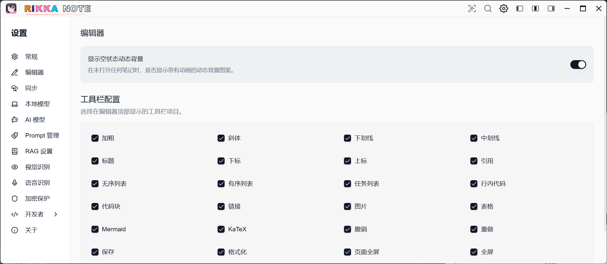

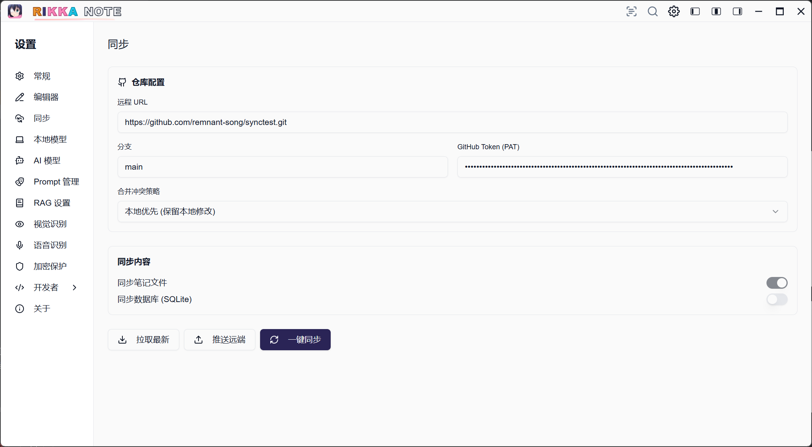

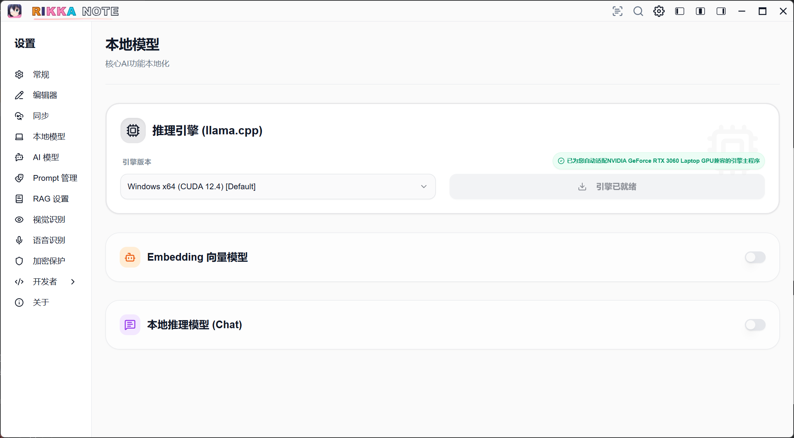

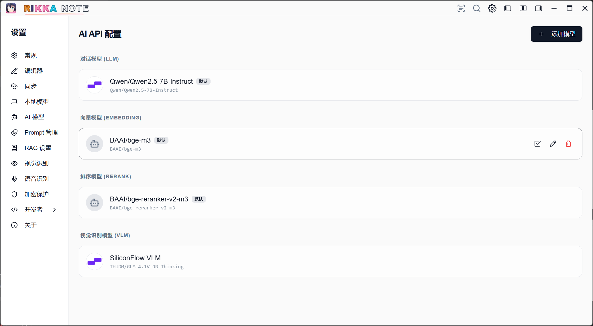

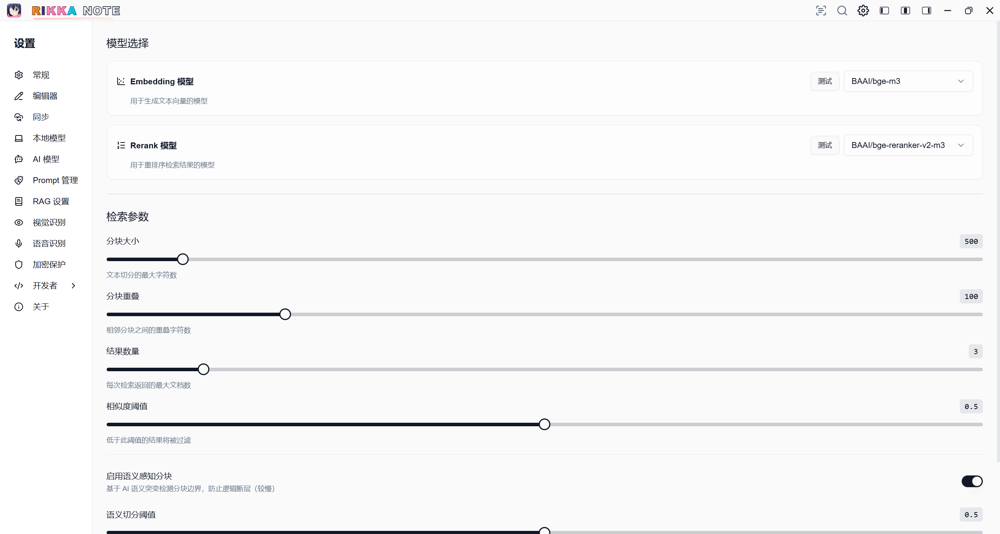

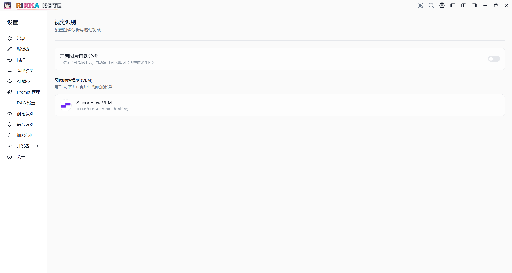

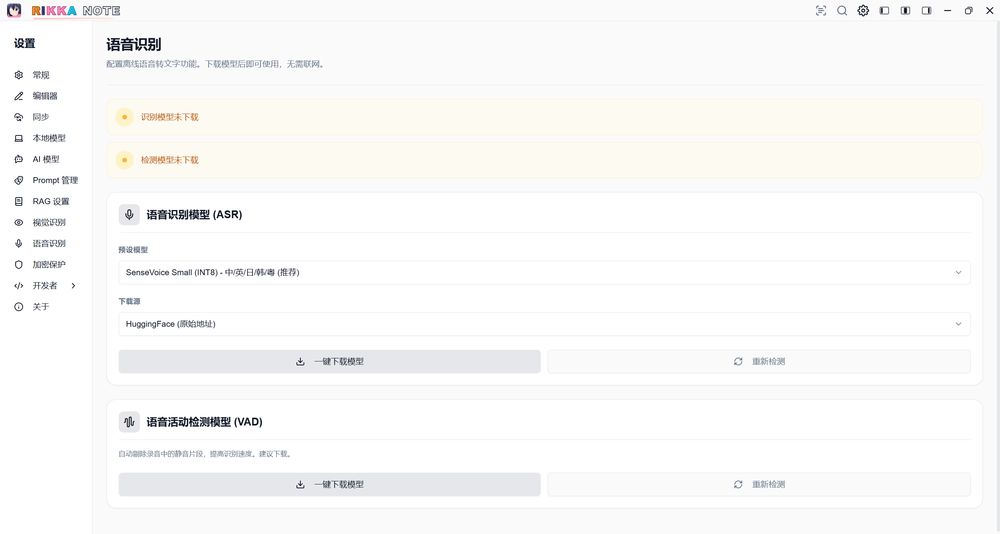

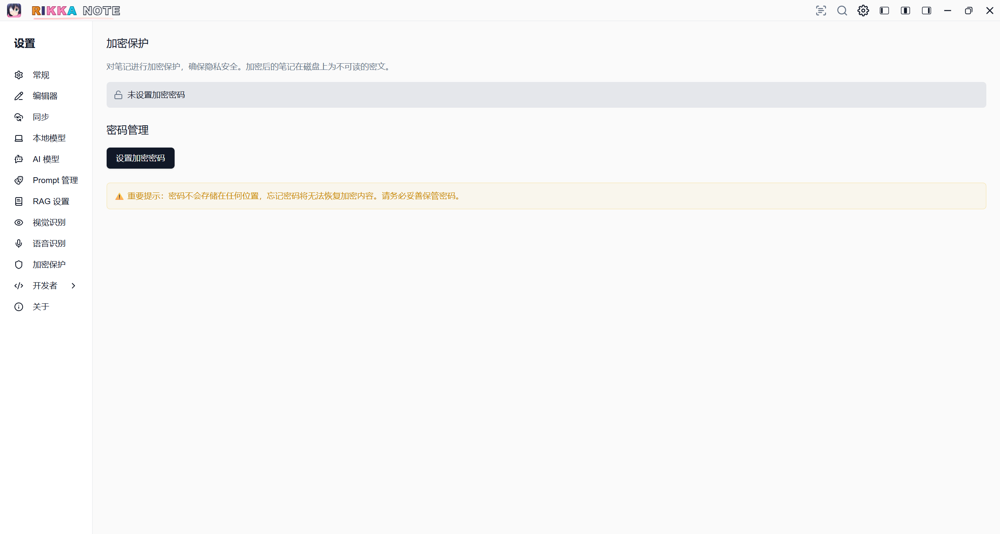

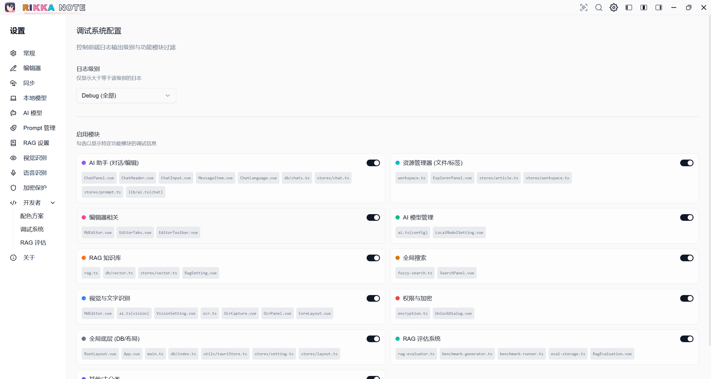

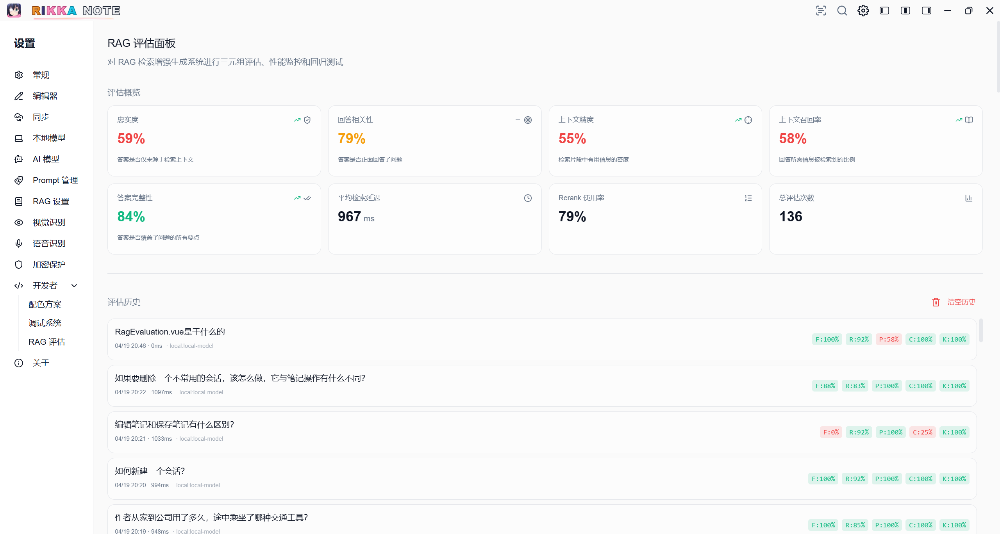


### 1 AI笔记助手
*   **双模式编辑器**：高性能 Markdown 编辑器，支持 KaTeX 算式、Mermaid 图表与多层级标题导航。
*   **AI 编辑协同**：
    *   **智能提案模式**：基于 AI 生成 Diff 差异，对比与一键“应用/撤销”。
    *   **Prompt 预设库**：内置知识提取、多语言翻译、结构化扩充等场景化指令流。

### 2 多模态输入
*   **离线 OCR**：windows api。
*   **离线实时语音输入 (ASR)**：集成 Sherpa-ONNX 引擎与 Rust 驱动的 VAD（语音活动检测），实现高精度、低延迟的离线语音转文字。
*   **AI 视觉增强 (VLM)**：自动分析笔记内图片视觉特征，生成结构化文本描述，让非结构化媒体数据可检索、可理解。

### 3 RAG 检索增强系统
*   **隐私确认流 (Confirmation UI)**：在将本地知识发送至 LLM 前，可视化展示检索到的笔记分块，用户可点击跳转查阅或一键剔除，确保隐私完全受控。
*   **混合检索架构**：向量搜索 (Dense) 与关键词搜索 (BM25) 深度融合，利用 RRF 算法提升生僻词与专业术语的召回精度。
*   **评测框架**：实时监控忠实度、回答相关性、上下文精度等指标，量化 AI 回答质量。

### 2.4 用户隐私保护
*   **Rust 级全链路加密**：DEK/KEK 两级密钥模型。密码通过 Rust 进程内存严格管控，笔记密文存储。
*   **本地并行推理引擎**：内置 `llama.cpp` 管理器，实现 embedding模型、LLM/SLM、ASR模型 的“零配置”傻瓜式一键部署及运行。


## 技术栈

- **Vue 3**
- **TypeScript**
- **Vite**
- **Tailwind CSS**
- **Tauri 2**
- **Rust**

---

##  环境配置

- **Node.js**: `v22.20.0`
- **NPM**: `v10.9.3`
- **Rust**: `1.81.0`
- **Cargo**: `1.81.0`
- **Java**: `OpenJDK 21.0.2`

---

## 项目结构树（待完善）
```
d:\graduation_project\project\rikka-note
├── public/                     # 静态资源
├── src/                        # 前端源代码
│   ├── components/             # 通用 UI 组件
│   │   ├── ui/                 # 基础原子组件 (Shadcn 风格)
│   │   ├── AppSidebar.vue      # 全局侧边栏
│   │   ├── AppStatus.vue       # 状态显示
│   │   ├── ModeToggle.vue      # 主题切换
│   │   └── ThemeProvider.vue   # 主题配置
│   ├── composables/            # 组合式函数 (AI、主题、Toast等)
│   ├── core/                   # 核心业务逻辑
│   │   ├── layouts/            # 核心布局封装
│   │   └── pages/              # 业务页面
│   │       ├── article/        # 笔记编辑与文件管理 (MdEditor, FileManager)
│   │       ├── record/         # AI 聊天信息与标注管理 (Chat, Mark, Tag)
│   │       ├── setting/        # 应用设置 (AI 配置、通用设置)
│   │       └── ArticlePage.vue # 笔记主入口
│   ├── db/                     # 数据库模块 (chats, notes, marks, tags, vector)
│   ├── hooks/                  # 全局钩子
│   ├── i18n/                   # 国际化配置
│   ├── layouts/                # 根布局
│   ├── lib/                    # 核心逻辑库 (AI、本地化、工作区管理)
│   ├── locales/                # 多语言 JSON (zh, en)
│   ├── router/                 # Vue Router 路由配置
│   ├── shared/                 # 共享样式与页面
│   ├── stores/                 # Pinia 状态管理 (Chat, Article, Setting, Sidebar 等)
│   ├── types/                  # TypeScript 类型定义
│   ├── utils/                  # 工具函数 (Device, Theme, Storage)
│   ├── App.vue                 # 根组件
│   └── main.ts                 # 入口文件
├── src-tauri/                  # Tauri 后端源代码
│   ├── capabilities/           # 权限策略配置
│   ├── icons/                  # 应用图标
│   ├── src/                    # Rust 实现代码
│   │   ├── app_setup.rs        # 应用初始化
│   │   ├── backup.rs           # 备份逻辑
│   │   ├── fuzzy_search.rs     # 模糊搜索 (Jieba-rs)
│   │   ├── lib.rs              # Tauri 指令注册入口
│   │   ├── main.rs             # Rust 入口
│   │   ├── screenshot.rs       # 截图功能实现
│   │   ├── tray.rs             # 系统托盘
│   │   ├── webdav.rs           # WebDAV 实现
│   │   └── window.rs           # 窗口控制
│   ├── Cargo.toml              # Rust 依赖配置
│   ├── tauri.conf.json         # Tauri 核心配置
│   └── build.rs                # 构建脚本
├── dist/                       # 构建输出目录
├── index.html                  # HTML 入口
├── package.json                # 前端依赖与脚本定义
├── tailwind.config.ts          # Tailwind 配置
└── tsconfig.json               # TypeScript 配置
```


## 开发指南

 `npm install`
 `npm run dev`
 `npm run build`
